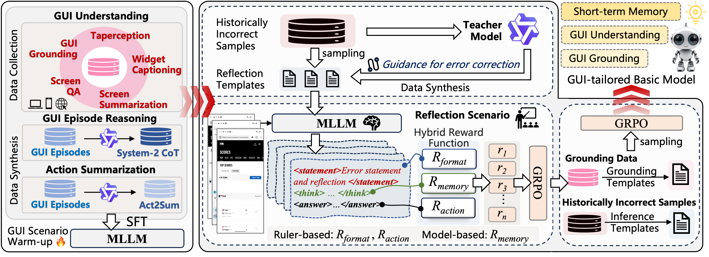

```markdown
### Error-Centric Learning for Reasoning Improvement in GUI Agent (AAAI 2026)



# IFF-GUI-3B 
*IFF-GUI-3B is a GUI–tailored vision-language models for robust GUI automation*

3B-parameter vision-language model derived from **Qwen2.5-VL-3B-Instruct**.  
Through multi-stage training and the data/strategy suite introduced in our paper, we obtain a model that

* keeps stable short-term memory,
* understands complicated desktop & mobile screens,
* generalises well to unseen GUIs,

and reaches state-of-the-art performance on our Chinese OOD GUI-automation benchmark.

We release one **base model** plus several **task-specialised checkpoints**:

| Model Checkpoint                            | Description                             |
|-------------------------------------------- |---------------------------------------- |
| IFF-GUI-3B                                  | Base (recommended starting point)       |
| IFF-GUI-3B-AITW                             | Finetuned for `AITW` benchmark          |
| IFF-GUI-3B-Mind2Web                         | Finetuned for `Mind2Web`                |
| IFF-GUI-3B-GUIOdyssey                       | Finetuned for `GUIOdyssey`              |
| IFF-GUI-3B-GUI-Understanding                | Finetuned for Chinese GUI comprehension |

Download links (replace `xxx` with the real URLs):
```
IFF-GUI-3B:               http://xxx
IFF-GUI-3B-AITW:          http://xxx
IFF-GUI-3B-Mind2Web:      http://xxx
IFF-GUI-3B-GUIOdyssey:    http://xxx
IFF-GUI-3B-GUI-Understanding: http://xxx
```

---

## 2. Quick Start

### 2.1 Set up the environment
```bash
# Clone this repo
git clone <repo_url> && cd <repo>

# Install python dependencies
pip install -r requirements.txt      # equals to:  sh requirements.txt
```

### 2.2 Run the model  
We provide two out-of-the-box launchers:

1. **vLLM** (fastest inference, GPU required): see `./fold_vllm`  
2. **Swift** (lighter, pure PyTorch): see `./fold_swift`

Choose one and follow the README inside the corresponding folder.

---

## 3. Finetuning / Task Customisation
You can further finetune the base checkpoint on your own data:

```bash
# Edit hyper-parameters in training.sh if necessary
bash training.sh
```

---

## 4. Data Synthesis Pipelines
We open-source all automatic data-generation scripts used in the paper:

```bash
# 1) Guideline synthesis
bash guideline.sh

# 2) System-2 CoT synthesis
bash CoT.sh

# 3) Action-to-Summary (Act2Sum) synthesis
bash Act2Sum.sh
```

---

## 5. Instruction Templates
All prompt templates (system, user, assistant roles) can be found in  
`/fold_template/`. Feel free to modify them for your own scenarios.

---

## 6. Example: GUI Automation Inference Loop
The following snippet shows how we collect **Act2Sum** traces with an HTTP server
running on `localhost:8000`:

```python
import requests, json

URL = "http://localhost:8000/v1/chat/completions"
HEADERS = {"Content-Type": "application/json"}

def chat(img_url: str, goal: str, action: str) -> str:
    query = MIND2WEB_SUM_PROMPT.replace("(goal)", goal)\
                               .replace("(action)", action)

    messages = [
        {"role": "system", "content": "You are a helpful assistant."},
        {"role": "user", "content": [
            {"type": "image_url", "image_url": {"url": img_url}},
            {"type": "text",       "text": query}
        ]}
    ]

    payload = {"model": "IFF-GUI-3B", "messages": messages, "temperature": 0}
    resp = requests.post(URL, headers=HEADERS, data=json.dumps(payload)).json()
    return resp["choices"][0]["message"]["content"]

Act2Sum = []
for img, goal, action in episode:            # iterate over GUI steps
    summary = chat(img, goal, action)
    Act2Sum.append(summary)

# Save / format Act2Sum as you like …
```

---

## 7. Folder Structure at a Glance
```
.
├── fold/               # 3 usage demos (vLLM, Swift, WebUI)
├── fold_vllm/          # vLLM launcher & configs
├── fold_template/      # all prompt templates
├── scripts/
│   ├── guideline.sh    # Guideline synthesis
│   ├── CoT.sh          # System-2 Chain-of-Thought synthesis
│   └── Act2Sum.sh      # Action-to-Summary synthesis
└── training.sh         # Finetuning entry
```

---

## 8. Citation
If you use IFF-GUI-3B or its derivatives in your research, please cite our paper (coming soon) 🙏

---

Happy hacking! Feel free to open issues or pull requests for any question.
```
